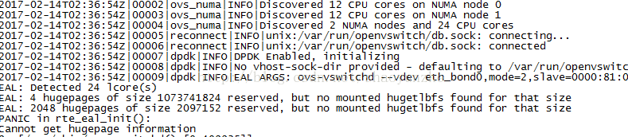
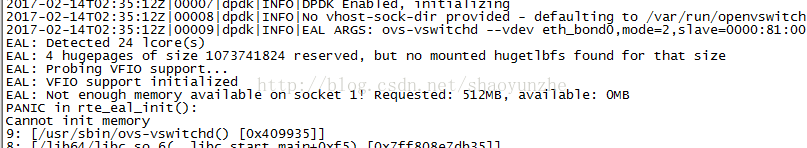
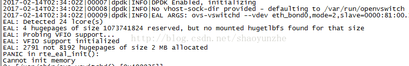
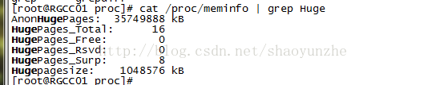

# 巨页总结


##1、hugepage永久 配置 

修改/etc/default/grub 中的 GRUB_CMDLINE_LINUX，然后运行 grub 更新并重启系统：

```shell
[root@~]# cat /etc/default/grub
GRUB_TIMEOUT=5
GRUB_DISTRIBUTOR="$(sed 's, release .*$,,g' /etc/system-release)"
GRUB_DEFAULT=saved
GRUB_DISABLE_SUBMENU=true
GRUB_TERMINAL_OUTPUT="console"
GRUB_CMDLINE_LINUX="crashkernel=auto rhgb quiet default_hugepagesz=1G hugepagesz=1G hugepages=16 hugepagesz=2M hugepages=2048 intel_iommu=off isolcpus=0,20,1,21,10,30,11,31"
GRUB_DISABLE_RECOVERY="true"

```

hugepage 的数量和类型可根据系统中的可用内存进行调整。 `isolcpus` 参数支持我们将某些 CPU 与 Linux 调度程序隔离，以便基于 DPDK 的应用能够锁定到这些 CPU 上。

注意：上面设置的是系统预留内存，如果是单cpu，预留大小肯定就是上面设置的值，如果是numa系统，每个cpu node平分上面设置的大小（比如系统有cpu node 0和node1，`hugepages``=``2048，`在查看/sys/devices/system/node/node0/hugepages/nr_hugepages时，大小肯定是1024）命令 echo ‘vm.nr_hugepages=2048' > /etc/sysctl.d/hugepages.conf也可以设置，但一定注意，有时发现grub设置的大页大小和实际大小不一样时，可能就是/etc/sysctl.d/hugepages.conf里的参数在作怪。默认情况下就是系统当前所有在线NUMA节点平均分配这些HugePages，除非那个NUMA节点本身没有足够的可用连续内存来生成 HugePages，那么此时HugePages将由另外一个NUMA节点生成

重启系统后，查看内核 cmdline 并按照如下方式分配 hugepage。

```shell
[root@~]# cat /proc/meminfo |grep Hug
AnonHugePages:    626688 kB
HugePages_Total:       0
HugePages_Free:        0
HugePages_Rsvd:        0
HugePages_Surp:        0
Hugepagesize:       2048 kB
```

接下来是安装 hugepage 文件系统，加载 `vfio-pci` 用户空间驱动程序(如果系统已经支持巨页，则可以省略该步)。

使用巨页需要挂载巨页系统到`/``mnt``/``huge`

```shell
mkdir -p /mnt/huge

mkdir -p /mnt/huge_2mb

mount -t hugetlbfs hugetlbfs /mnt/huge

mount -t hugetlbfs none /mnt/huge_2mb -o pagesize=2MB
```


##2、临时配置

Hugepage能够动态预留，执行命令：

```
$ echo 1024 > /sys/kernel/mm/hugepages/hugepages-2048kB/nr_hugepages
```


上面通过没有节点关联的系统分配内存页。如果希望强制分配给指定的NUMA节点，你必须做：

```
echo 1024 >/sys/devices/system/node/node0/hugepages/hugepages-2048kB/nr_hugepages

#echo 1024 > /sys/devices/system/node/node1/hugepages/hugepages-2048kB/nr_hugepages

hugepages-2048kB指预留2M的大小为1024个，一共2*1024M，hugepages-1048576kB指预留1G的大小

```


## 3、查看挂载情况：

```shell
[root@ ~]#  cat /proc/mounts
rootfs / rootfs rw 0 0
proc /proc proc rw,relatime 0 0
sysfs /sys sysfs rw,relatime 0 0
devtmpfs /dev devtmpfs rw,relatime,size=65988392k,nr_inodes=16497098,mode=755 0 0
devpts /dev/pts devpts rw,relatime,gid=5,mode=620,ptmxmode=000 0 0
tmpfs /dev/shm tmpfs rw,relatime 0 0
/dev/mapper/vg_xzpcpsitj02n010253-lv_root / ext4 rw,relatime,barrier=1,data=ordered 0 0
/proc/bus/usb /proc/bus/usb usbfs rw,relatime 0 0
/dev/sda1 /boot ext4 rw,relatime,barrier=1,data=ordered 0 0
none /proc/sys/fs/binfmt_misc binfmt_misc rw,relatime 0 0
/etc/auto.misc /misc autofs rw,relatime,fd=7,pgrp=3585,timeout=300,minproto=5,maxproto=5,indirect 0 0
-hosts /net autofs rw,relatime,fd=13,pgrp=3585,timeout=300,minproto=5,maxproto=5,indirect 0 0
/dev/loop0 /mnt/centos7.3 iso9660 ro,relatime 0 0
/dev/loop1 /mnt/centos6.5 iso9660 ro,relatime 0 0
/dev/loop2 /mnt/redhat6.3 iso9660 ro,relatime 0 0

```

会看见hugetlbfs /mnt/huge hugetlbfs rw,relatime 0 0这样的，这就是挂载了大页，在free不够时，在确定可以umount时，把这些umount一下就可以了，vpp代码自动挂载大页的，ovs+dpdk需要手动挂载.


## 4、ovs+dpdk大页问题

有时没法重启服务器只能配置临时大页时，但启动ovs+dpdk会报错，

A：



这是因为没有手动挂载大页造成的，需要执行mount -t hugetlbfs hugetlbfs /mnt/huge

B:

)

这是因为配置的大页大小不满足ovs+dpdk大页需求，需要增大临时大页配置

C:



这种情况具体原因我还没有搞清楚，但可以通过先设置很小的配置，然后再设置大的配置可以解决

比如原来的设置是4096   echo 4096 > /sys/kernel/mm/hugepages/hugepages-2048kB/nr_hugepages

AnonHugePages:   5218304 kB
HugePages_Total:     4096
HugePages_Free:     4096
HugePages_Rsvd:        0
HugePages_Surp:        0
Hugepagesize:       2048 kB

现在先设置 echo 128 > /sys/kernel/mm/hugepages/hugepages-2048kB/nr_hugepages

再设置echo 4096 > /sys/kernel/mm/hugepages/hugepages-2048kB/nr_hugepages

估计是内存连续问题造成的

##5、其他问题

有时，你会发现大页



不管怎样配置，free就是0，top或是free命令，查看内存基本使用完了，但是我们并没有启动vpp或是ovs，这个很大可能就是其他进程使用了hugepage，使用以下命令查找

find /proc/*/smaps | xargs grep -ril "anon_hugepage"

原理请查看<https://toutiao.io/posts/n4hzg1/preview>里hugepage内容


